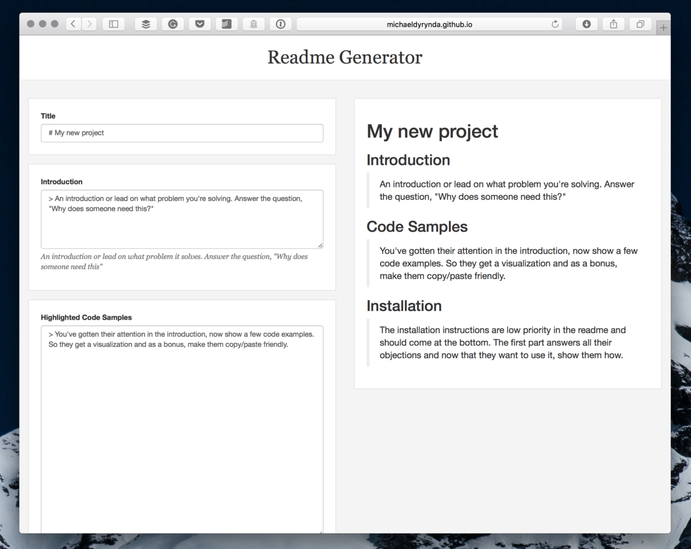

# Readme generator

## Introduction

Developers love to share code in the form of packages, full apps, or tiny modules. Sharing is great, but one area that a lot of developers forget about is the readme file. This file is now arguably one of the most important pieces for your project and one that a lot of users don’t spend any time on.

When looking for an existing open source project to solve a problem you had, you've probably asked yourself one or more of the following questions:

1. Will it solve my problem?
2. Can I trust this code?
3. Can I trust the team/developer who created it?
4. Will I be able to get help if I'm stuck?
5. Are issues or pull requests dealt with?
6. Am I willing to keep this updated if the project dies?
7. Can I build this easier myself?

This [simple application](https://michaeldyrynda.github.io/readme-generator) assists you in writing a readme for your own projects in a way that guides you to answering these questions.

## Learn more

* Check out [Eric L Barnes'](https://twitter.com/ericlbarnes) article on [how to write a README that rocks](https://dotdev.co/how-to-write-a-readme-that-rocks-bc29f279611a) for the inspiration behind this generator.
* I published [Building a README generator with Vue.js](https://dotdev.co/building-a-readme-generator-with-vue-js-b653cd1638d8) on .dev, which talks about how this application was built.
